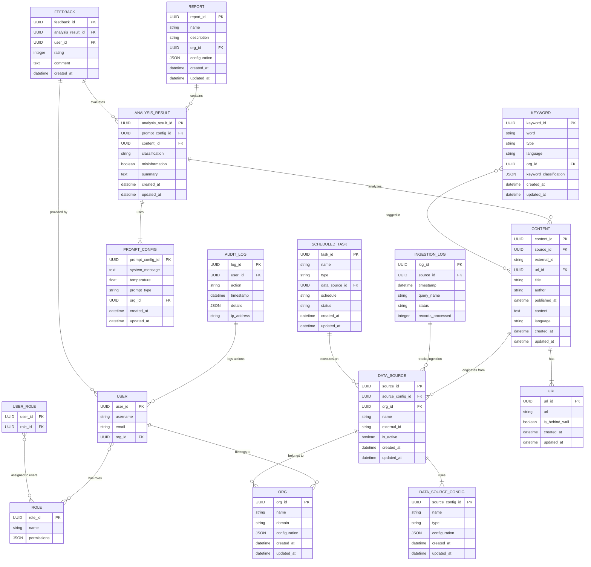

# Entity-Relationship Diagram (ERD) Proposal
This ERD represents a system involving users, organizations, roles, data sources, content, keywords, and various analysis results. The system is designed for tracking and analyzing data from various sources, managing users and their roles, and reporting on the results of these analyses.

## Entities and Attributes
1. User
- Represents the individuals who interact with the system.
- Attributes: user_id (PK), username, email, org_id (FK)
2. Role

- Defines various roles (e.g., Admin, Analyst, User) with specific permissions.
- Attributes: role_id (PK), name, permissions (JSON)
3. User_Role

- A join table linking Users and Roles to represent a many-to-many relationship.
- Attributes: user_id (FK), role_id (FK)
4. Org (Organization)

- Represents an organization (tenant) in the system.
- Attributes: org_id (PK), name, domain, configuration (JSON), created_at, updated_at
5. Data_Source_Config

- Defines configurations for different types of data sources (e.g., Twitter, Facebook, etc.).
- Attributes: source_config_id (PK), name, type, configuration (JSON), created_at, updated_at
6. Data_Source

- Represents an individual data source account (e.g., a specific Twitter account, a Facebook page).
- Attributes: source_id (PK), source_config_id (FK), org_id (FK), name, external_id, is_active, created_at, updated_at
7. Keyword

- Stores keywords used for various purposes, such as tagging content or analysis.
- Attributes: keyword_id (PK), word, type, language, org_id (FK), keyword_classification (JSON), created_at, updated_at
8. Content

- Represents content pieces retrieved from data sources (e.g., a tweet, a post, an article).
- Attributes: content_id (PK), source_id (FK), external_id, url_id (FK), title, author, published_at, content (text), language, created_at, updated_at
9. URL

- Stores URLs of content pieces.
- Attributes: url_id (PK), url, is_behind_wall (boolean), created_at, updated_at
10. Prompt_Config

- Stores configurations for prompts used in content analysis (e.g., instructions for the language model).
- Attributes: prompt_config_id (PK), system_message, temperature, prompt_type, org_id (FK), created_at, updated_at
11. Analysis_Result

- Stores the results of content analysis performed using language models.
- Attributes: analysis_result_id (PK), prompt_config_id (FK), content_id (FK), classification, misinformation (boolean), summary, created_at, updated_at
12. Report

- Represents reports generated based on analysis results.
- Attributes: report_id (PK), name, description, org_id (FK), configuration (JSON), created_at, updated_at
13. Ingestion_Log

- Tracks data ingestion activities.
- Attributes: log_id (PK), source_id (FK), timestamp, query_name, status, records_processed
14. Scheduled_Task

- Represents tasks scheduled for execution, such as data ingestion or content analysis.
- Attributes: task_id (PK), name, type, data_source_id (FK), schedule, status, created_at, updated_at
15. Audit_Log

- Logs system actions performed by users (e.g., login, logout, report generation).
- Attributes: log_id (PK), user_id (FK), action, timestamp, details (JSON), ip_address
16. Feedback

- Stores feedback on analysis results provided by users.
- Attributes: feedback_id (PK), analysis_result_id (FK), user_id (FK), rating, comment, created_at
## Relationships:
1. User → Org (One-to-One)

- Each User belongs to one Org. This relationship ensures that each user is associated with an organization (tenant).
2. User ↔ Role (Many-to-Many via User_Role)

- A User can have multiple Roles, and a Role can be assigned to multiple Users. This is managed through the User_Role join table.
3. Data_Source → Org (One-to-Many)

- One Org can have multiple Data Sources, but each Data Source belongs to one Org.
4. Data_Source ↔ Data_Source_Config (One-to-One)

- Each Data Source is linked to a specific Data_Source_Config, which defines its configuration (e.g., the data type or platform).
5. Content → Data_Source (Many-to-One)

- Each Content is sourced from a specific Data Source.
6. Content ↔ URL (One-to-One)

- Each Content piece has one associated URL.
7. Analysis_Result → Content (Many-to-One)

- Each Analysis_Result is linked to one Content piece that was analyzed.
8. Analysis_Result → Prompt_Config (Many-to-One)

- Each Analysis_Result uses one Prompt_Config for its analysis.
9. Keyword ↔ Content (Many-to-Many)

- A Content piece can be tagged with multiple Keywords, and a Keyword can be associated with multiple Content pieces.
10. Report → Analysis_Result (One-to-Many)

- Each Report can contain multiple Analysis_Results.
11. Ingestion_Log → Data_Source (Many-to-One)

- Each Ingestion_Log entry tracks a specific Data Source.
12. Audit_Log → User (Many-to-One)

- Each Audit_Log entry is associated with a specific User who performed the action.
13. Scheduled_Task → Data_Source (Many-to-One)

- Each Scheduled_Task is linked to a Data Source to execute specific tasks like data ingestion.
14. Feedback → Analysis_Result (Many-to-One)

- Each Feedback is tied to one Analysis_Result to provide ratings and comments.
15. Feedback → User (Many-to-One)

- Each Feedback is provided by a specific User.
